# Netty笔记
## 概述
+ Netty 是一个异步事件驱动的网络通信框架，它提供了一种基于事件驱动的、非阻塞的、高性能的IO通信模型。
+ Netty 提供了多种传输协议，包括TCP、UDP、HTTP、HTTPS、FTP等。Netty 提供了多种编解码器，包括JSON、XML、Protobuf、Avro等。Netty 提供了多种编解码器，包括JSON、XML、Protobuf、Avro等。Netty 提供了多种编解码器，包括JSON、XML、Protobuf、Avro等。Netty 提供了多种编解码器，包括JSON、XML、Proto
## netty经典设计思想
### 责任链模式：Netty 的核心设计思想之一就是责任链模式。 Netty 的核心组件是 ChannelHandler，它实现了 ChannelInboundHandler 和 ChannelOutboundHandler 接口，分别用于处理入站和出站事件。ChannelHandler 可以通过链式调用的方式实现事件处理逻辑的解耦。ChannelHandler在ChannelPipeline中注册，ChannelPipeline是ChannelHandler的集合，ChannelPipeline中的ChannelHandler按照注册顺序执行。
### 适配器模式：Netty 的核心设计思想之二就是适配器模式。Netty 的核心组件是 ChannelHandler，它实现了 ChannelInboundHandler 和 ChannelOutboundHandler 接口，分别用于处理入站和出站事件。ChannelHandler 可以通过适配器模式实现事件处理逻辑的解耦。
### 上下文模式：Netty 的核心设计思想之三就是上下文模式，它实现了 ChannelHandlerContext 接口，用于管理 ChannelHandler 的上下文信息。

## 笔记
### netty核心组件
+ bootstrap:netty框架启动类主入口类；
+ eventLoop(group)P:事件循环处理的线程（组）eventLoopGroup中包含多个eventLoop，每个eventLoop对应一个线程；
+ channel:可以粗略的理解为socket；
+ channelHandler: 处理数据的核心组件（适配器模式）；
+ channelPipeline:把channelHandler们组织在一起（责任链模式）；
+ byteBuffer: 缓冲区；
+ channelFuture: 出站操作异步获取结果。

#### eventLoop和eventLoopGroup

#### ChannelHandlerMask里面定义了哪些是出站事件和入站事件。
static final int MASK_ONLY_INBOUND =  MASK_CHANNEL_REGISTERED |

MASK_CHANNEL_UNREGISTERED | MASK_CHANNEL_ACTIVE | MASK_CHANNEL_INACTIVE | MASK_CHANNEL_READ |
MASK_CHANNEL_READ_COMPLETE | MASK_USER_EVENT_TRIGGERED | MASK_CHANNEL_WRITABILITY_CHANGED;

private static final int MASK_ALL_INBOUND = MASK_EXCEPTION_CAUGHT | MASK_ONLY_INBOUND;

static final int MASK_ONLY_OUTBOUND =  MASK_BIND | MASK_CONNECT | MASK_DISCONNECT |
MASK_CLOSE | MASK_DEREGISTER | MASK_READ | MASK_WRITE | MASK_FLUSH;
private static final int MASK_ALL_OUTBOUND = MASK_EXCEPTION_CAUGHT | MASK_ONLY_OUTBOUND;

#### ChannelPipeline和ChannelHandlerContext
+ ChannelPipeline提供了ChannelHandler的注册和移除，ChannelHandlerContext提供了ChannelHandler的调用。
+ ChannelPipeline是一个双向链表，定义了用于在该链上出战和入站事件流的api，可以分辨出站和入站事件。
+ 出站事件和入站事件分属不同的handler，一般情况下在业务没有要求的情况下可以不考虑出站事件和入站事件之间的顺序。
+ 而同属一个方向的handler是有顺序的，因为上一个handler处理结果往往是下一个handler的要求的输入。
+ ChannelHandlerContext是ChannelPipeline和ChannelHandler的桥梁(关联prev,next)，它提供了对ChannelHandler的调用，比如传递handler之间的事件，获取ChannelHandler前一个和后一个ChannelHandler。
+ 如果写数据的时候是用channel.write()或者channel.pipeline().write()，那么事件就会流经整个ChannelPipeline，如果用context.write()，那么事件就会从当前的写入的context对应的channelHandler开始流经ChannelPipeline。

+ fire开头的方法，会把事件从当前ChannelHandler开始，传递到下一个ChannelHandler。

#### Channelhandler
+ 出站事件继承ChannelOutboundHandler，入站事件继承ChannelInboundHandler，实现需要用到的方法。
+ channelOutboundHandler.read()方法，是一个业务方（如网卡）要求一个读动作，也就是触发了订阅的op_read，netty将读这个"要求读动作"打包成一个入站事件，然后传入ChannelPipeline。
+ 对一个channel最多读16次，所以满16此次或者读不到数据了就停止发送上述事件。
+ 共享handler用注解 @ChannelHandler.Sharable。

#### buffer
+ netty会在pipeline里加一个head和tail上下文，在这两个上下文自动释放了buffer。
+ simpleChannelInboundHandler.channelRead()方法，将数据要不传递要不释放。自己实现也要注意，否则会造成内存泄露。。

#### bootstrap
+ serverBootstrap的主从reactor模式。

### netty内置通信传输模式
#### NIO:jdk实现。
#### EPOLL: netty实现。

#### OIO：就是BIO
#### Local：一个jvm内通信
#### Embedded：单元测试用

### ChannelOption(红色为需注意，详情见org.alex.netty.ChannelOption)
+ SO_KEEPALIVE:是否开启TCP长连接，默认是开启的。
+ **SO_RCVBUF**:接收缓冲区默认大小。(proc/sys/net/ipv4/tcp_wmen)，不建议调整，操作系统会自动调整。
+ **SO_SNDBUF**:发送缓冲区默认大小。(proc/sys/net/ipv4/tcp_rmen)，不建议调整，操作系统会自动调整。
+ **SO_LINGER**: 调用close()方法是，该值若开启，则会把缓冲区数据发送完才返回结果，否则会立即返回，但是数据会丢失。
+ **TCP_NODELAY**:无论应用层给的报文有多小，都立即拉过来，而不是等应用层给的数据量达到一定的量级才拉过来。（有可能产生粘包问题）
+ TCP_FASTOPEN:是否开启TCP FastOpen，默认是关闭的。
+ SO_BROADCAST:是否开启广播，默认是关闭的。
+ SO_OOBINLINE:是否开启紧急数据接收，默认是关闭的。
+ SO_TIMEOUT:接收超时时间。
+ SO_REUSE_PORT:是否开启端口复用，默认是关闭的。
+ SO_KEEPALIVE:是否开启TCP长连接，默认是开启的。
+ **SO_REUSEADDR**: TCP三次握手的timeWaiting状态期间是否允许重复使用地址和端口，子网内部或多网卡可以考虑配置，跨网段不建议配置。 
  举个栗子：某个服务器进程占用了TCP的80端口进行监听，此时再次监听该端口就会返回错误，使用该参数就可以解决问题，该参数允许共用该端口，这个在服务器程序中比较常见，比如某个程序非正常退出，
  该程序占用的端口可能要被占用一段时间才能允许其他进程使用，而且程序死掉之后，内核需要一定的时间才能释放该端口，不设置SO_REUSEADDR就无法正常使用该端口。
+ **SO_BACKLOG**:连接数，哪些客户端完成了三次握手。

### 粘包、半包问题
#### 什么是TCP粘包、半包？
+ 粘包（Sticky Packet）：粘包指的是在网络通信中，发送方连续发送的多个数据包被接收方一次性接收的现象。这导致接收方将多个数据包看作一个大的数据包来处理，造成数据边界混乱的情况。粘包问题主要发生在TCP协议中，由于TCP是面向流的协议，没有明确的数据边界，因此多个数据包在传输过程中可能被合并成一个数据流。

+ 半包（Half Packet）：半包指的是接收方在处理数据时，并没有接收到一个完整的数据包，而是只收到了部分数据包。这种情况可能发生在TCP协议中，接收端的数据读取速度比发送端的发送速度慢，或者数据在传输过程中被拆分成多个片段。接收端需要等待后续数据到达才能组成完整的数据包来处理。

#### 粘包产生的原因：
TCP发送缓冲区大小限制：发送方将多个小数据包一次性写入TCP发送缓冲区，TCP协议在发送数据时不会考虑应用层的数据边界，因此接收方可能会将它们当作一个大数据包接收。
网络传输延迟和拥塞：网络传输中的延迟或拥塞可能导致多个发送端的数据包在接收端到达时被合并成一个大的数据包，从而形成粘包现象。

#### 半包产生的原因：
TCP的流式传输特性：TCP是面向流的协议，无法保证接收端每次读取的数据大小与发送端发送的数据包大小完全一致。接收端可能会一次读取到部分数据（半包），需要等待后续数据到达才能组成完整的数据包。
应用层读取速度慢：如果接收端的应用层读取速度比发送端的发送速度慢，TCP协议会不断将数据放入接收端的接收缓冲区，直到形成完整的数据包。

#### netty的解决方案：
+ 分隔符；
+ 消息定长 FixedLengthFrameDecoder；
+ 指明消息长度 io.netty.handler.codec.LengthFieldBasedFrameDecoder。

### channelRead和channelReadComplete
TCP/网络传输中的术语

channelRead()方法，是netty将数据从socketChannel读到buffer中，然后调用ChannelInboundHandler的channelRead()方法。
channelReadComplete()方法，是netty将buffer中的数据传递给ChannelInboundHandler的channelRead()方法,只执行一次。

### 编解码器

编解码器是Netty提供的数据处理方式，负责数据格式转换，便于传输和存储。

- **编码器**: 对象 → `MessageToMessageDecoder` → JSON明文 → `ByteToMessageDecoder` → 密文
- **解码器**: 密文 → `ByteToMessageDecoder` → JSON明文 → `MessageToMessageDecoder` → 对象

在 Netty 框架中，核心编解码组件包括：
- **ByteToMessageDecoder**: 将字节解码为消息对象。
    - **作用**：处理网络字节数据至应用消息。
    - **方法**：`decode(ChannelHandlerContext ctx, ByteBuf in, List<Object> out)`。

- **MessageToMessageDecoder**: 实现消息对象间转换。
    - **作用**：转换/处理消息类型。
    - **方法**：`decode(ChannelHandlerContext ctx, Object msg, List<Object> out)`。

- **MessageToMessageEncoder**: 消息对象编码。
    - **作用**：消息对象转为字节或其他格式以发送。
    - **方法**：`encode(ChannelHandlerContext ctx, Object msg, List<Object> out)`。

#### 总结

- **ByteToMessageDecoder**: 字节流 → 消息对象。
- **MessageToMessageDecoder**: 消息A → 消息B。
- **MessageToMessageEncoder**: 消息对象/数据 → 字节流/编码数据。

这些编解码器简化数据处理，提升通信效率与可靠性。

#### 应用

- **ByteToMessageCodec & MessageToMessageCodec**: 编解码接口，处理网络数据编码/解码。
    - **ByteToMessageCodec**: 字节数据至消息对象。
        - `encode(ChannelHandlerContext ctx, Object msg, ByteBuf out)`
        - `decode(ChannelHandlerContext ctx, ByteBuf in, List<Object> out)`

    - **MessageToMessageCodec**: 消息对象间通用转换。
        - `encode(ChannelHandlerContext ctx, Object msg, List<Object> out)`
        - `decode(ChannelHandlerContext ctx, Object msg, List<Object> out)`

编解码器简化网络通信数据处理，如格式转换、压缩、序列化等，通过ChannelPipeline集成，实现数据格式无缝转换。

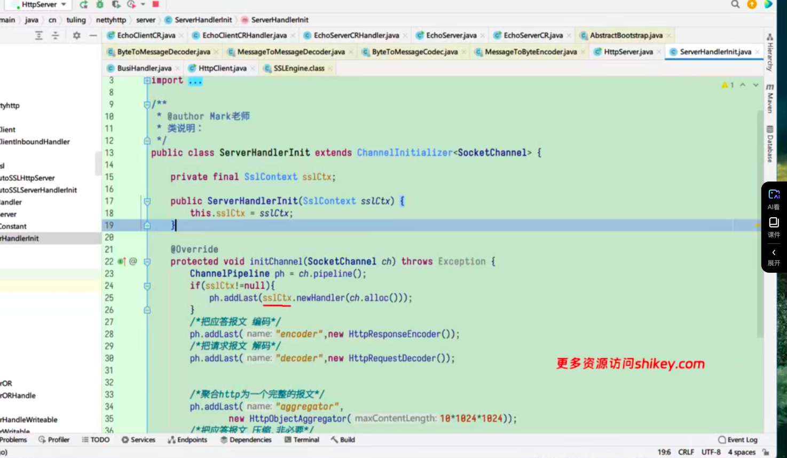
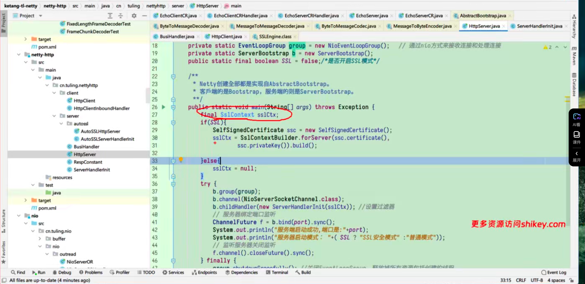
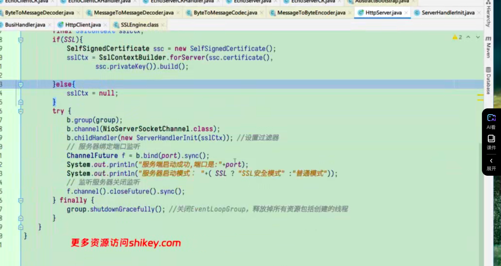

### 序列化机制
序列化机制是网络通信中重要的一种技术，它用于将数据对象转换为字节流，以便在网络中传输。
序列化机制可以提高网络通信的效率和可靠性，因为字节流可以直接在网络中传输，而不需要经过复杂的编码和解码过程。
序列化的目的简单说就是将对象转换为字节流，以便在网络中传输，以及保存到磁盘上。
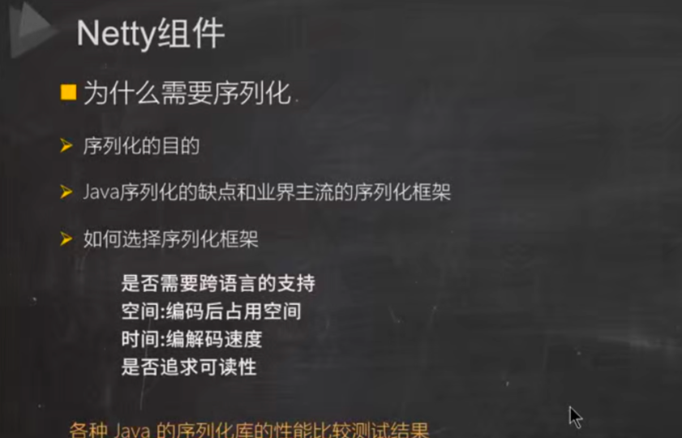
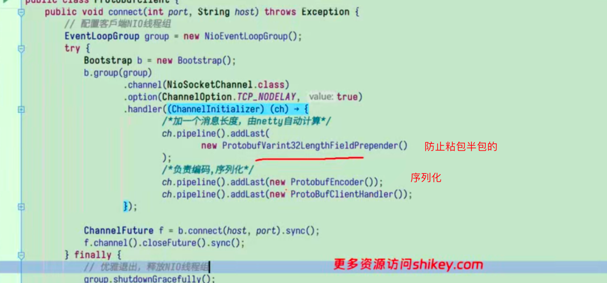
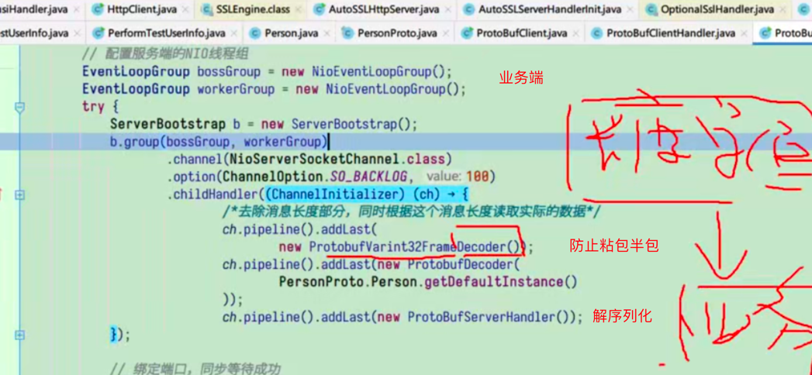
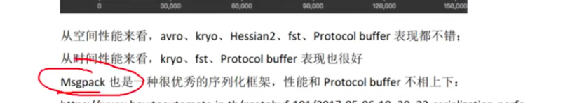
#### 集成messagePack
- 1.导入依赖
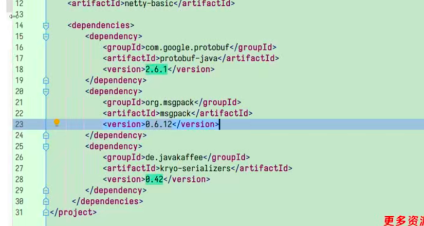
- 2.将需要序列化的类加入注解
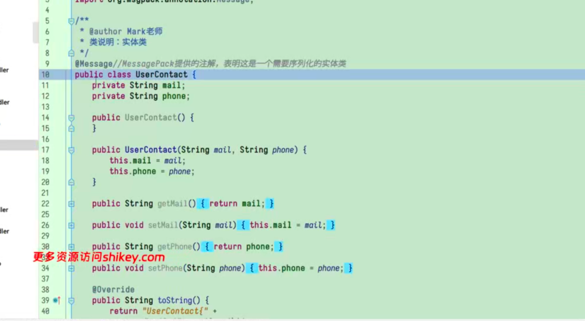
- 3.编写messageback编码器
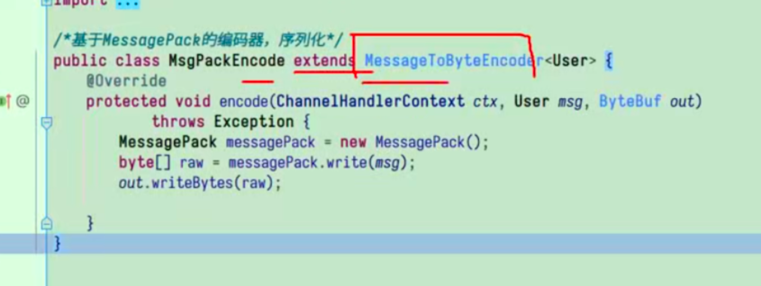
- 4.解决粘包半包问题
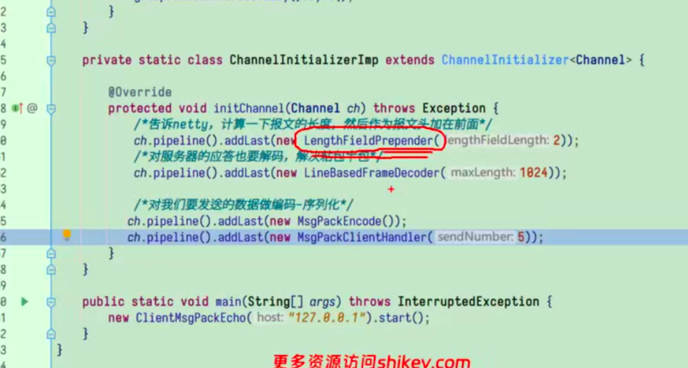
- 5.服务端
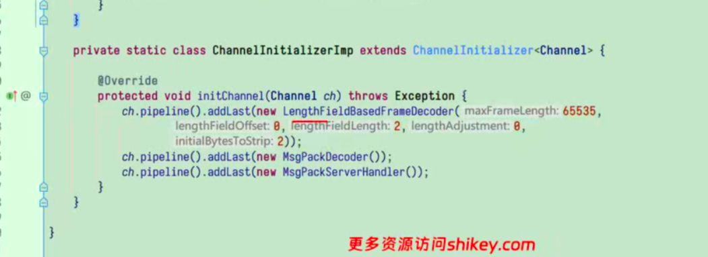
- 6.服务端解码器
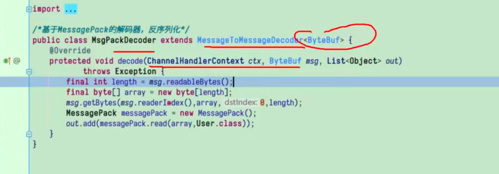